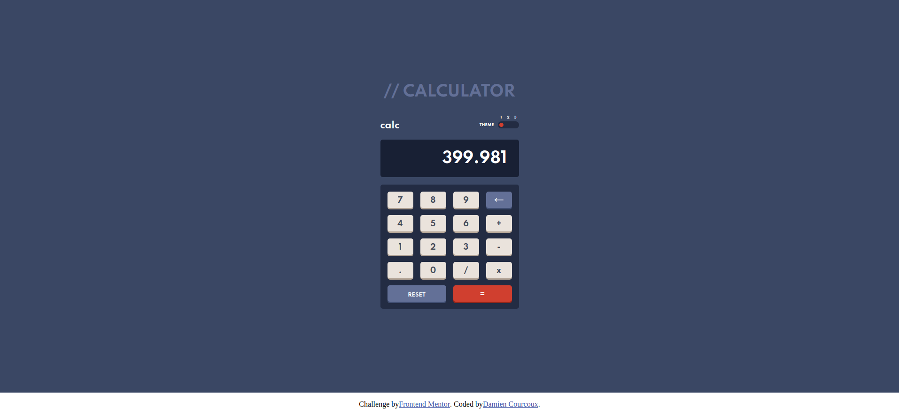

# Frontend Mentor - Solution d'application de Calculatrice

Il s'agit d'une solution au [défi de l'application Calculatrice sur Frontend Mentor](https://www.frontendmentor.io/challenges/calculator-app-9lteq5N29). Les défis Frontend Mentor vous aident à améliorer vos compétences en codage en créant des projets réalistes.

## Table des matieres

- [Frontend Mentor - Solution d'application de Calculatrice](#frontend-mentor---solution-dapplication-de-calculatrice)
  - [Table des matieres](#table-des-matieres)
  - [Apercu](#apercu)
    - [Le defi](#le-defi)
    - [Capture d'ecran](#capture-decran)
    - [Liens](#liens)
  - [Mon processus](#mon-processus)
    - [Construit avec](#construit-avec)
    - [Ce que j'ai appris](#ce-que-jai-appris)
    - [Developpement continu](#developpement-continu)
    - [Ressources utiles](#ressources-utiles)
  - [Auteur](#auteur)

## Apercu

### Le defi

Les utilisateurs doivent être capables de :

- [x] Voir la taille des éléments s'ajuster en fonction de la taille de l'écran de leur appareil
- [x] Effectuer des opérations mathématiques telles que l'addition, la soustraction, la multiplication et la division
- [x] Ajustez le thème de couleur en fonction de leur préférence
- [ ] **B o n u s** : Faites vérifier leur préférence de thème initiale à l'aide de`prefers-color-scheme` et enregistrez toutes les modifications supplémentaires dans le navigateur

### Capture d'ecran



### Liens

- URL de la solution : [https://www.frontendmentor.io/solutions/calculator-app-frontend-mentor-by-damiencourcoux-sgNhjGaRG](https://www.frontendmentor.io/solutions/calculator-app-frontend-mentor-by-damiencourcoux-sgNhjGaRG)
- URL du site en direct : [https://calculator-damiencourcoux.netlify.app/](https://calculator-damiencourcoux.netlify.app/)

## Mon processus

### Construit avec

- Balisage sémantique HTML5
- Propriétés personnalisées CSS
- Flexbox
- CSS Grid
- Flux de travail axé sur le mobile

### Ce que j'ai appris

J'ai appris à utiliser les variables CSS :

```css
body[data-theme="theme one"] {
    --mainBackground: hsl(222, 26%, 31%);
    --toggleKeypadBackground: hsl(223, 31%, 20%);
    --screenBackground: hsl(224, 36%, 15%);

    --keyBackgroundFirst: hsl(225, 21%, 49%);
    --keyShadowFirst: hsl(224, 28%, 35%);
    --keyBackgroundToggleSecond: hsl(6, 63%, 50%);
    --keyShadowSecond: hsl(6, 70%, 34%);
    --keyBackgroundThird: hsl(30, 25%, 89%);
    --keyShadowThird: hsl(28, 16%, 65%);

    --textFirst: hsl(221, 14%, 31%);
    --textSecond: #fff;

    color: var(--textSecond);
}
```

J'ai pu aussi apprendre un peu plus sur le fonctionnement de CSS Grid :

```css
.settings {
    display: grid;
    grid-template-columns: 200px 50px repeat(3, 15px);
    grid-template-rows: 15px 15px;
    align-items: stretch;
}
```

### Developpement continu

Grâce à ce projet, j'ai idée plus précise sur le CSS Grid et les variables CSS, maintenant me reste plus qu'à bien le mettre en pratique.
J'ai pu aussi bien validé mes acquis en JavaScript pure.

### Ressources utiles

- [CSS Grid Generator](https://cssgrid-generator.netlify.app/) - Cela m'a aidé à comprendre vraiment le fonctionnement de chaque colonne et ligne de l'outil qu'est CSS Grid.
- [MDN Web Docs](https://developer.mozilla.org/fr/) - Et il y a aussi bien évidemment, la Bible du code ! Le fabuleux site MDN, sur laquelle on peut compter, à chaque question que l'on se poserait.

## Auteur

- Website - [Damien Courcoux](https://www.damiencourcoux.me)
- Frontend Mentor - [@DamienCourcoux](https://www.frontendmentor.io/profile/DamienCourcoux)
